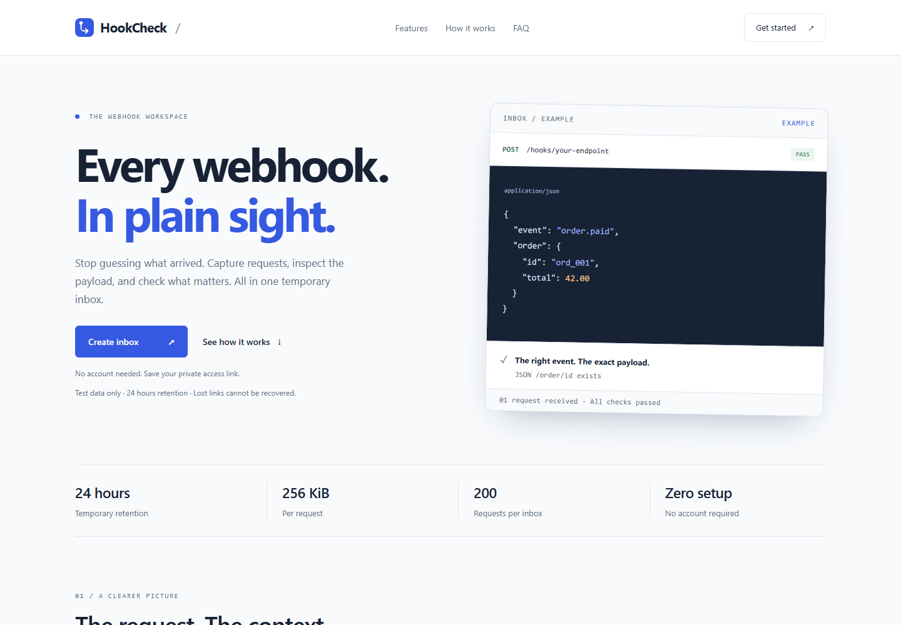
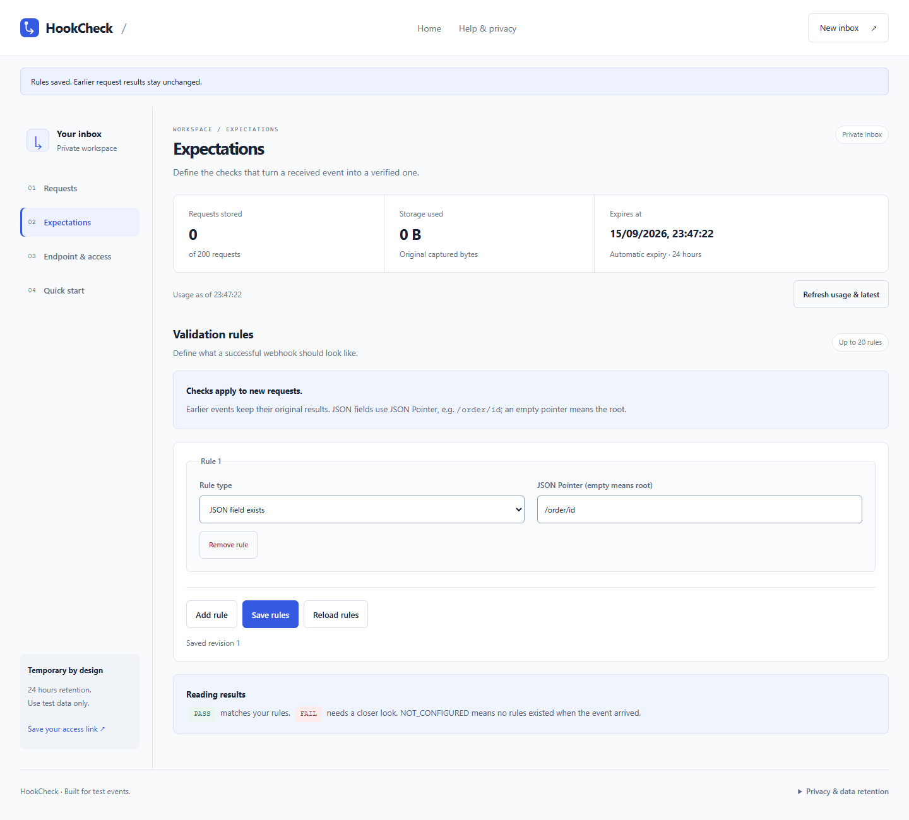
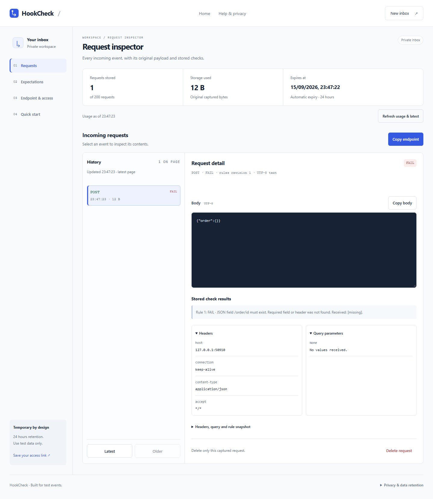
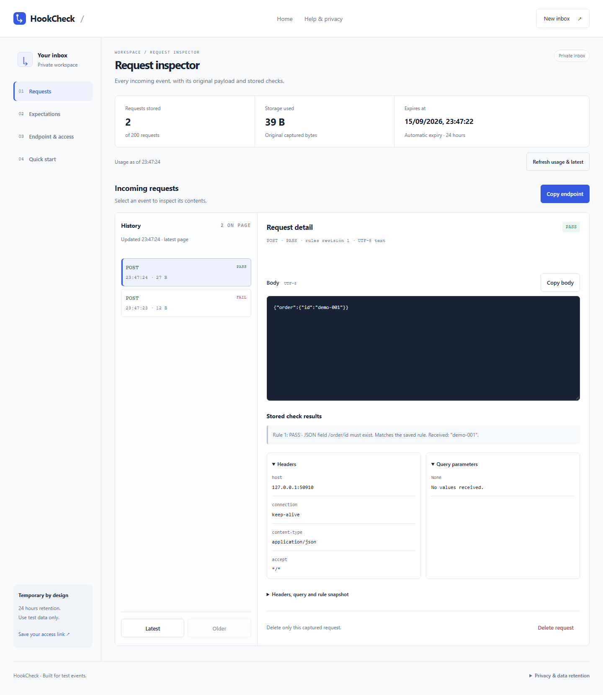

# HookCheck

[English](#english) · [Tiếng Việt](#tieng-viet)

## English

A webhook debugging workspace for developers. Create an inbox, send a webhook, and see exactly what arrived and why it passed or failed your expectations.

**Deployment:** The full application is deployed on Google Cloud with HTTPS, PostgreSQL, monitoring, backups, and a tested recovery path. Access is currently restricted, so there is no public demo yet. This repository showcases the product; its application source is maintained privately.

### Interface

Screenshots from a local session using synthetic events. Access tokens are hidden.

#### Home

#### Validation rules

#### Request inspection

| Missing required field | Valid request |
| --- | --- |
|  |  |

### What you can do

- Temporary inboxes without account setup
- Original request bodies and metadata, including malformed JSON and binary content
- Configurable checks for HTTP methods, headers, and JSON fields
- Request history with the rules and results recorded at capture time
- Separate capture and management access
- Inbox expiry, deletion, and request/storage limits

### A typical debugging session

1. Create an inbox and save its management link.
2. Configure expectations and send a webhook to the capture endpoint.
3. Inspect the request and individual check results in the browser dashboard.
4. Correct the sender and compare the new event with the earlier failure.

Updating rules affects future requests; earlier receipts retain their original results.

### Built beyond the prototype

- **Faithful capture:** Preserves original bytes across seven HTTP methods, including malformed JSON and binary payloads. Each receipt keeps the rules and results from when it arrived, so later edits cannot rewrite history.
- **Private by design:** The endpoint that receives webhooks cannot inspect them. A separate secret link controls access; captured content is displayed as inert text or base64.
- **Consistent under load:** PostgreSQL transactions keep captured requests, rule results, and quotas together. The service acknowledges a capture only after it is committed.
- **Cloud deployment:** The containerized application runs behind HTTPS with a persistent database and monitoring. A separate Kubernetes deployment demonstrates the same webhook workflow and keeps captured data through a VM restart.
- **Recoverable data:** Rollback to an earlier application image and restoration from an encrypted database backup have been exercised with retained synthetic requests.

**Stack:** TypeScript, Node.js, Fastify, PostgreSQL, Nunjucks, Docker, Playwright, GitHub Actions, Google Cloud, Kubernetes, Terraform.

---

## Tiếng Việt

HookCheck là công cụ gỡ lỗi webhook cho lập trình viên. Tạo hộp thư nhận webhook, gửi sự kiện, rồi xem chính xác dữ liệu đã đến và lý do từng điều kiện kiểm tra đạt hoặc không đạt.

**Triển khai:** Ứng dụng đầy đủ đã được triển khai trên Google Cloud với HTTPS, PostgreSQL, giám sát, sao lưu và quy trình phục hồi đã được kiểm tra. Quyền truy cập hiện còn giới hạn nên chưa có bản dùng thử công khai. Repo này giới thiệu sản phẩm; mã nguồn ứng dụng được duy trì riêng tư.

### Giao diện

Ảnh chụp từ phiên chạy local với các sự kiện giả lập. Token truy cập đã được che.

#### Trang chủ

#### Thiết lập điều kiện kiểm tra

#### Kiểm tra request

| Thiếu trường bắt buộc | Request hợp lệ |
| --- | --- |
|  |  |

### Bạn có thể làm gì

- Tạo hộp thư nhận webhook tạm thời mà không cần tài khoản
- Xem body gốc và metadata của request, kể cả JSON lỗi định dạng và dữ liệu nhị phân
- Đặt điều kiện kiểm tra HTTP method, header và trường JSON
- Xem lịch sử request cùng bộ điều kiện và kết quả tại thời điểm nhận
- Phân quyền riêng giữa gửi webhook và xem hoặc quản lý hộp thư
- Tự hết hạn, xóa dữ liệu và giới hạn số request cùng dung lượng lưu trữ

### Một phiên gỡ lỗi điển hình

1. Tạo hộp thư và lưu liên kết quản lý bí mật.
2. Đặt điều kiện mong đợi rồi gửi webhook đến địa chỉ nhận.
3. Xem request và kết quả từng điều kiện trên giao diện web.
4. Sửa bên gửi và so sánh sự kiện mới với lần gửi lỗi trước đó.

Thay đổi điều kiện chỉ ảnh hưởng đến các request nhận sau đó; kết quả cũ vẫn được giữ nguyên.

### Không chỉ là bản mẫu

- **Giữ đúng dữ liệu nhận:** Lưu nguyên byte gốc qua bảy HTTP method, kể cả JSON lỗi định dạng và payload nhị phân. Mỗi request giữ bộ điều kiện và kết quả lúc được nhận, nên việc sửa điều kiện sau đó không làm thay đổi lịch sử.
- **Quyền truy cập tách biệt:** Địa chỉ nhận webhook không cho phép xem dữ liệu. Một liên kết bí mật riêng kiểm soát quyền truy cập; nội dung nhận được chỉ hiển thị dưới dạng văn bản trơ hoặc base64.
- **Dữ liệu nhất quán khi có tải:** Giao dịch PostgreSQL ghi request, kết quả kiểm tra và quota cùng nhau. Dịch vụ chỉ xác nhận đã nhận sau khi giao dịch được commit.
- **Triển khai trên cloud:** Ứng dụng đóng gói container chạy qua HTTPS, có cơ sở dữ liệu lưu trữ lâu dài và hệ thống giám sát. Một bản triển khai Kubernetes riêng cũng chạy được cùng luồng webhook và giữ dữ liệu sau khi khởi động lại VM.
- **Có thể phục hồi dữ liệu:** Quy trình quay về image ứng dụng cũ và khôi phục từ bản sao lưu cơ sở dữ liệu mã hóa đã được thực hiện với các request giả lập được giữ nguyên.

**Công nghệ:** TypeScript, Node.js, Fastify, PostgreSQL, Nunjucks, Docker, Playwright, GitHub Actions, Google Cloud, Kubernetes, Terraform.

